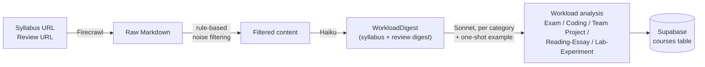
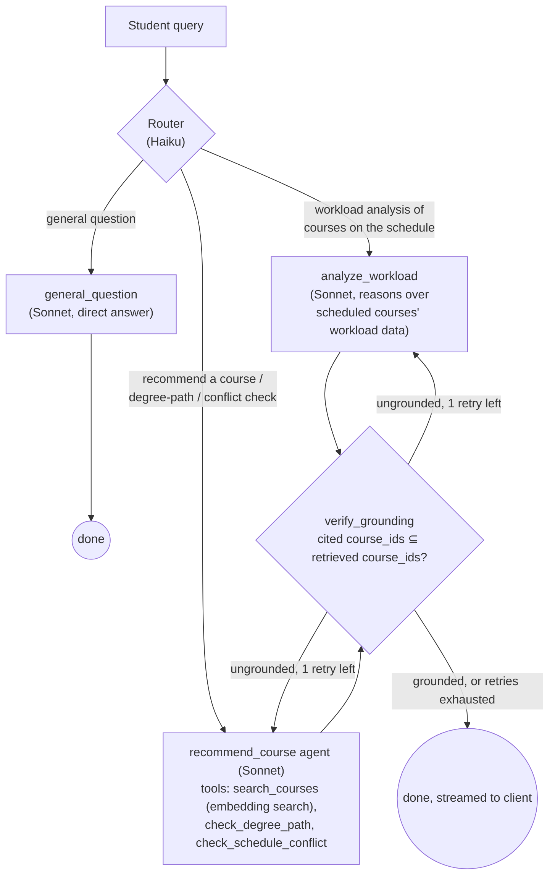
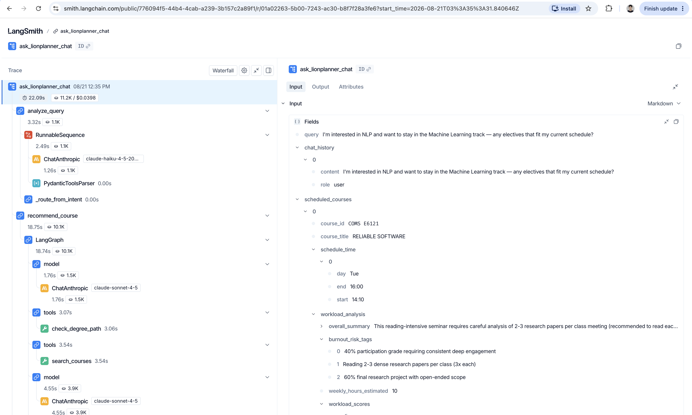

# LionPlanner

A course-planning app that helps Columbia students build a schedule around actual workload and time, not just catalog listings.

[](LICENSE)


## Overview & Motivation

Most course-registration tools focus on the basics — filtering by department, showing meeting times, listing prerequisites. But when students actually plan a semester, what they need is more layered: how demanding is this course in terms of workload, what does the whole schedule add up to once every course is stacked together, and does a course that fits time-wise also fit the degree path they're following. Mostly, answering "how much work is this course" meant leaving the registration site entirely — reading the syllabus, digging through review sites, and cross-checking degree requirements by hand.

**LionPlanner pulls all of that into one place: a scheduling tool where syllabus content, instructor reviews, workload analysis, schedule conflicts, and degree-path fit are all one chat message away**

## Key Features

- Built on real Columbia data — course syllabi and reviews sourced from CULPA, the review site Columbia students actually use.
- A DB construction pipeline that turns raw syllabus and review text into a structured, multi-dimension workload analysis using LLMs.
- Filtering by course title, department, course level, and day/time.
- **Ask LionPlanner**, a chat assistant that recommends courses and analyzes schedule workload, grounded in the course database, the degree-path database, and whatever is currently on the student's calendar.

## Demo

Live app: **https://lionplanner-front.vercel.app/**

## Tech Stack

| Layer | Technology |
|---|---|
| Backend | Python, FastAPI, LangGraph, LangChain, LangSmith |
| LLMs | Claude (Sonnet & Haiku, via `langchain-anthropic`) |
| Embeddings | Voyage AI (`voyage-3.5`) |
| Scraping | Firecrawl, with a Jina Reader fallback |
| Database | Supabase (Postgres + `pgvector`) |
| Frontend | React 19, TypeScript, Vite, Tailwind CSS |
| Infra / CI | Docker, Fly.io (backend), Vercel (frontend), GitHub Actions |

## Getting Started

### Prerequisites

- Python 3.11+
- Node.js 20+
- A [Supabase](https://supabase.com) project (Postgres + `pgvector`)
- API keys: **Anthropic**, **Voyage AI**, **Firecrawl** (or **Jina**) for scraping, and (optional) **LangSmith** for visualizing agentic workflow

### Installation

**1. Clone and set up the database**

```bash
git clone https://github.com/<your-org>/lionplanner.git
cd lionplanner
```

Run [`sql/schema.sql`](sql/schema.sql) in your Supabase project's SQL editor. This creates the `courses`, `degree_path`, and `chats` tables, enables `pgvector`, sets up row-level security (read-only for the anon key), and defines the `match_courses` RPC used for semantic search.

**2. Backend**

```bash
python -m venv .venv
source .venv/bin/activate
pip install -r requirements.txt
cp .env.example .env   # fill in SUPABASE_*, ANTHROPIC_API_KEY, VOYAGE_API_KEY, etc.
```

**3. Frontend**

```bash
cd frontend
npm install
cp .env.example .env.local   # VITE_SUPABASE_URL, VITE_SUPABASE_ANON_KEY, VITE_API_BASE_URL
```

### Usage

Build the course database (scrapes syllabi/reviews, runs workload analysis, upserts to Supabase — see [Architecture](#architecture--pipeline) below):

```bash
python -m src.main               # only re-analyzes courses whose content changed
python -m src.main --force-refresh   # bypass the diff check and re-run everything
```

Run the Ask LionPlanner API:

```bash
uvicorn src.api.main:app --reload
```

Run the frontend:

```bash
cd frontend
npm run dev
```

## Architecture & Pipeline

### Data pipeline

Each course goes from a syllabus URL and a review URL to a fully structured, five-dimension workload analysis stored in Supabase:



- **Scraping**: [`src/web_functions/scrape.py`](src/web_functions/scrape.py) tries Firecrawl first (handles JS-rendered pages), falling back to the Jina Reader API.
- **Noise filtering**: [`src/pipeline/content_filters.py`](src/pipeline/content_filters.py) strips boilerplate (honesty policy, office hours, images) from syllabi before any LLM sees them, and keeps only the "AI-Generated Summary" / "Most Agreed Review" sections from CULPA pages.
- **Digest**: [`src/pipeline/digest.py`](src/pipeline/digest.py) uses a lightweight model (Haiku) to compress the filtered text down to whatever carries workload signal, preserving direct quotes verbatim so later steps can cite them.
- **Category analysis**: [`src/pipeline/analyzer_pipeline.py`](src/pipeline/analyzer_pipeline.py) scores five workload dimensions — **Exam, Coding, Team Project, Reading/Essay, Lab/Experiment** — in parallel with Sonnet. Each category prompt includes a **fabricated one-shot example** (a realistic but invented course, syllabus excerpt, review excerpt, and scored output) to calibrate the model against a fixed anchor point, so scores stay comparable across very different courses.
- A SHA-256 diff check ([`src/pipeline/diff_engine.py`](src/pipeline/diff_engine.py)) skips re-analysis for courses whose syllabus/review content hasn't changed, unless `--force-refresh` is passed.
- The syllabus is also summarized and embedded (Voyage AI) for semantic search, and the result is upserted into the `courses` table in Supabase.

### Backend: Ask LionPlanner

The chat feature is a LangGraph state machine ([`src/agents/graph.py`](src/agents/graph.py)) with a routing node, three specialist nodes, and a shared grounding-verification step:



- **Router** (`src/agents/router.py`): a single Haiku call classifies the query into `recommend_course`, `analyze_workload`, or `general_question` — nothing else happens here.
- **`analyze_workload`**: **a fixed workflow** (no retrieval needed) that reasons directly over the `workload_analysis` JSON of whatever courses are on the student's calendar.
- **`recommend_course`**: **the one true agent node** (`langchain.agents.create_agent`), free to call its tools as many times as needed:
  - `search_courses` — semantic search over syllabus embeddings.
  - `check_degree_path` — looks up required/elective courses for a track from the curated `degree_path` table, more authoritative than a topic guess when a student names a concentration.
  - `check_schedule_conflict` — deterministic day/time overlap check in code, since LLMs are unreliable at interval arithmetic.
- **`verify_grounding`**: not another LLM call — a plain set-membership check that every course the answer cites was actually retrieved or provided this turn. On a failure it routes back to the originating node once with corrective feedback; if it fails again, it gives up with a fixed fallback message instead of looping.
- Answers stream token-by-token over Server-Sent Events (`src/api/main.py`) directly to the frontend chat panel.  


*A real `recommend_course` run: the router picks `recommend_course`, the agent calls `check_degree_path` → `search_courses` → `check_schedule_conflict` in sequence, and `verify_grounding` passes it through with no retry needed. [View the full interactive trace on LangSmith →](https://smith.langchain.com/public/776094f5-44b4-4cab-a239-3b157c2a89f1/r/01a02263-5b00-7243-ac30-b8f7f28a3fe6?start_time=2026-08-21T03%3A35%3A31.840646Z)*

### Frontend

React 19 + Vite + Tailwind, talking to Supabase directly (read-only, anon key) for course data and to the FastAPI backend for chat:

- `CourseListPanel` / `FilterPanel` / `DualRangeSlider` — course search and filtering (title, department, level, day/time).
- `CalendarGrid` / `CourseBlock` / `CourseHoverCard` / `TotalCreditsCard` — the drag-and-drop weekly schedule view, with live conflict detection.
- `AskLionPlanner` / `MarkdownMessage` — the chat panel, consuming the backend's SSE stream and rendering Markdown as it arrives.
- `hooks/useCourses.ts`, `hooks/useChat.ts` — data fetching and chat-streaming state; `utils/appStorage.ts`, `utils/chatStorage.ts` persist filters, schedule, and chat sessions to `localStorage`.

### Project structure

```
src/
  agents/        # LangGraph nodes: router, recommend_course, analyze_workload,
                  # general_question, verify_grounding, graph wiring
  api/           # FastAPI app (SSE chat endpoint)
  pipeline/      # scrape → filter → digest → analyze course-DB pipeline
  db/            # Supabase client (reads + writes)
  web_functions/ # Firecrawl / Jina scraping
  schemas/       # Pydantic models (Course, WorkloadAnalysis)
  data/          # curated course/professor/degree-path source data
  main.py        # pipeline entrypoint (python -m src.main)

frontend/
  src/
    components/  # calendar, filters, course list, Ask LionPlanner chat
    hooks/       # useCourses, useChat
    lib/         # Supabase client
    utils/       # filters, schedule conflict logic, localStorage persistence

sql/schema.sql   # Supabase schema, RLS policies, match_courses RPC
```

## Future Work

1. **Broader course coverage** — currently centered on courses in the MS CS program; extending to more departments would make the tool useful to a wider set of students.
2. **Automated syllabus/review discovery** — syllabus formats vary wildly by professor and aren't always published at all. The current course DB is built from a manually curated list of syllabus/review URLs; a follow-up agent that discovers and crawls these automatically would remove that bottleneck.
3. **Verification on the DB-construction side** — Ask LionPlanner already self-corrects via `verify_grounding`, but the pipeline that generates the workload analysis in the first place has no equivalent second-pass verification of its own AI-generated output.

## Contributing & License

Contributions are welcome — feel free to open an issue or a pull request.

Licensed under the [MIT License](LICENSE).
