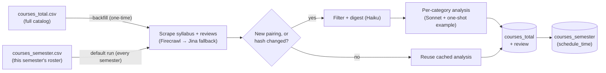
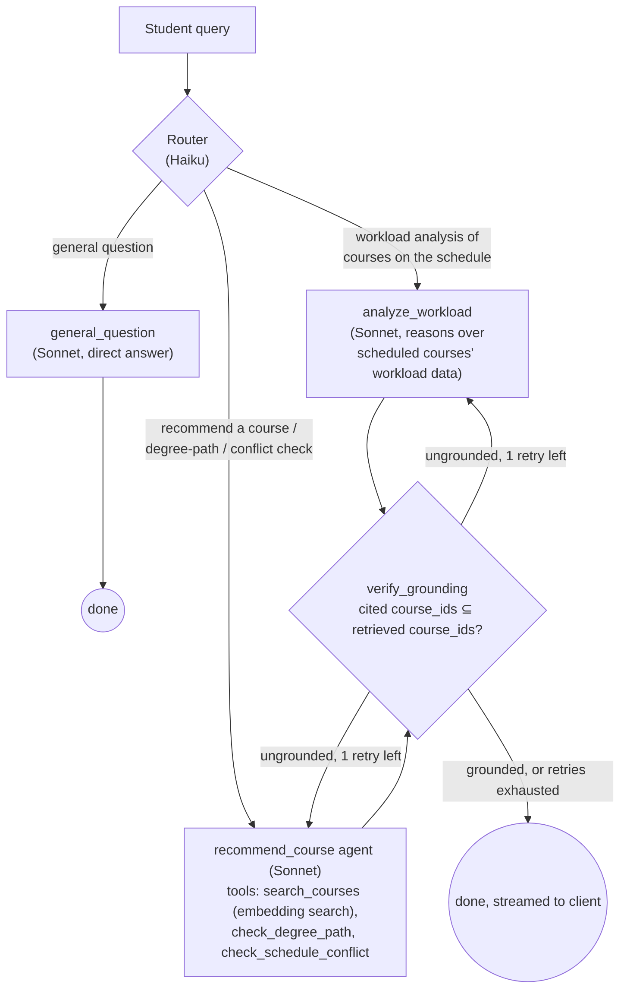

# LionPlanner

A course-planning app that helps Columbia students build a schedule around actual workload and time, not just catalog listings.

[](LICENSE)


## Overview & Motivation
Most course-registration tools focus on the basics such as filtering, schedules, and prerequisites.
But when students actually plan a semester, what they need is more layered.
Students are curious about how demanding this course is, how tough the whole schedule would be once every course is stacked together, and whether a course fits their degree path.
To answer "how much work is this course", students must leave the registration site, search for syllabi and reviews, and cross-check degree requirements by hand.

**LionPlanner pulls all of that into one place: a scheduling tool where syllabus content, instructor reviews, workload analysis, schedule conflicts, and degree-path fit are all one chat message away**

## Key Features

- **Built on real Columbia data** — course syllabi and reviews sourced from CULPA, the review site Columbia students actually use.
- **A DB construction pipeline** that turns raw syllabus and review text into a structured, multi-dimension workload analysis using LLMs.
- **Filtering** by course title, department, course level, and day/time.
- **Ask LionPlanner**, a chat assistant that recommends courses and analyzes schedule workload, grounded in the course database, the degree-path database, and whatever is currently on the student's calendar.

## Demo

Live link: **https://lionplanner-front.vercel.app/**

## Tech Stack

| Layer | Technology |
|---|---|
| Backend | Python, FastAPI, LangGraph, LangChain, LangSmith |
| LLMs | Claude |
| Embeddings | Voyage AI |
| Scraping | Firecrawl, Jina Reader |
| Database | Supabase |
| Frontend | React 19, TypeScript, Vite, Tailwind CSS |
| Infra / CI | Docker, Fly.io (backend), Vercel (frontend), GitHub Actions |

## Getting Started

### Prerequisites

- Python 3.11+
- Node.js 20+
- A [Supabase](https://supabase.com) project
- API keys: **Anthropic**, **Voyage AI**, **Firecrawl** (or **Jina**), and (optional) **LangSmith**

### Installation

**1. Clone and set up the database**

```bash
git clone https://github.com/JHshin6688/LionPlanner.git
cd lionplanner
```

Run the SQL query in your Supabase project's SQL editor
- [`sql/schema_v2.sql`](sql/schema_v2.sql)
  - `review` : table for review url of each professor
  - `courses_total` : table for every course/instructor pairing ever analyzed
  - `courses_semester` : table for this semester's offerings
  - `courses_semester_view` : virtual table that LionPlanner actually use
  - `degree_path` : table for degree paths in Columbia (Currently, only several paths of MSCS program)
  - `chats` : table for user queries and LionPlanner's responses

- Deprecated
  - [`sql/schema.sql`](sql/schema.sql) — creates `courses` (one monolithic table for courses), `degree_path`, and `chats`.
  - [`sql/migrate_to_v2.sql`](sql/migrate_to_v2.sql) - migrate old version into the new tables

**2. Backend**

```bash
python -m venv .venv
source .venv/bin/activate
pip install -r requirements.txt
cp .env.example .env   # fill in SUPABASE_*, ANTHROPIC_API_KEY, VOYAGE_API_KEY, etc.
```

**3. Frontend**

```bash
cd frontend
npm install
cp .env.example .env.local   # VITE_SUPABASE_URL, VITE_SUPABASE_ANON_KEY, VITE_API_BASE_URL
```

### Usage

Build the course database (scrapes syllabi/reviews, runs workload analysis, upserts to Supabase — see [Architecture](#architecture--pipeline) below).
  - `src/data/courses_total.csv` : entire course data
  - `src/data/courses_semester.csv` : course data for this semester
  - `src/data/professors.csv` : review urls for entire professors
  - `src/data/professors_semester.csv` : review urls for professors opening courses in this semester
  - `src/data/degree_path.json` : fundamental & elective courses for several degree paths of MSCS in Columbia

```bash
# 1. One-time: bulk-analyze every (course, instructor) pairing in courses_total.csv - needed once
python -m src.main --backfill

# 2. Every semester: sync course data with this semester courses_semester.csv against the current roster
# Only scrapes + re-analyzes a (course, instructor) pairing if it's new or its syllabus/review content changed
# Upserts course data to courses_semester table
python -m src.main

# 3. Same as the semester sync, but bypasses the diff check and re-analyzes every course in courses_semester.csv
python -m src.main --force-refresh
```

Run the Ask LionPlanner API:

```bash
uvicorn src.api.main:app --reload
```

Run the frontend:

```bash
cd frontend
npm run dev
```

## Architecture & Pipeline

### Data pipeline

<!-- The course database is split into three tables instead of one monolithic `courses` table, so that re-running the pipeline every semester doesn't mean re-scraping and re-analyzing the entire catalog from scratch:

- **`review`** — one row per instructor: their scraped review page.
- **`courses_total`** — a durable, semester-independent cache of every `(course_id, instructor_name)` pairing ever analyzed. The only table the analysis pipeline writes `workload_analysis` / `syllabus_summary` / embeddings to — a recurring course+instructor combo whose content hasn't changed skips re-analysis entirely and just reuses this row.
- **`courses_semester`** — thin: just this semester's `(course_id, instructor_name)` roster plus `schedule_time`. Everything else the app needs is read through `courses_semester_view`, a join of all three tables, so there's exactly one stored copy of every value. -->



- **Scraping**: [`src/web_functions/scrape.py`](src/web_functions/scrape.py) tries **Firecrawl** first (handles JS-rendered pages), falling back to the **Jina Reader API**.
- **Noise filtering**: [`src/pipeline/content_filters.py`](src/pipeline/content_filters.py) strips boilerplate (honesty policy, office hours, images) from syllabi before any LLM sees them, and keeps only the "AI-Generated Summary" / "Most Agreed Review" sections from CULPA pages.
- **Digest**: [`src/pipeline/digest.py`](src/pipeline/digest.py) uses **Claude Haiku** to compress the filtered text down to whatever carries workload signal, preserving direct quotes verbatim so later steps can cite them.
- **Category analysis**: [`src/pipeline/analyzer_pipeline.py`](src/pipeline/analyzer_pipeline.py) scores five workload dimensions — Exam, Coding, Team Project, Reading/Essay, Lab/Experiment — in parallel with **Sonnet**. Each category prompt includes a fabricated one-shot example (a realistic but invented course, syllabus excerpt, review excerpt, and scored output) to calibrate the model against a fixed anchor point, so scores stay comparable across very different courses.
- **Syllabus Embedding**: [`src/pipeline/embeddings.py`](src/pipeline/embeddings.py) creates embedding of each course's syllabus with **Voyage AI** for semantic search
- **SHA-256 diff check**: [`src/pipeline/diff_engine.py`](src/pipeline/diff_engine.py) decides "new pairing, or hash changed?" above. It skips re-scraping/re-analysis for a `(course, instructor)` pairing already in `courses_total` whose syllabus/review content hasn't changed, unless `--force-refresh` is passed.
- **Two entry points** (`src/main.py`)
  - `python -m src.main --backfill` runs the one-time, unconditional bulk analysis of the full catalog (`courses_total.csv`) into an initially-empty database
  - `python -m src.main` is the recurring per-semester sync against `courses_semester.csv`, diff-checked as above.
  - Before either runs, `validate_instructor_coverage` fails fast if a courses CSV references an instructor missing from its matching professors CSV.

### Backend: Ask LionPlanner

The chat feature is a **LangGraph** state machine ([`src/agents/graph.py`](src/agents/graph.py)) with a routing node, three specialist nodes, and a shared grounding-verification step:



- **`Router`**: a single Haiku call classifies the query into `analyze_workload`, `recommend_course`, or `general_question`.
- **`analyze_workload`**: **a fixed workflow**
  - Reason directly over the `workload_analysis` JSON of courses on the student's calendar. (no retrieval needed)
- **`recommend_course`**: **an agent node**
  - `search_courses` — semantic search over syllabus embeddings
  - `check_degree_path` — looks up required/elective courses for a track from the `degree_path` table
  - `check_schedule_conflict` — deterministic day/time overlap check in code
- **`general_question`**: **a direct answer**
  - Response by **Claude Sonney** directly
- **`verify_grounding`**: **a verification node**
  - Plain set-membership check that every course the answer cites was actually retrieved or provided this turn
  - On a failure, it routes back to the originating node once with corrective feedback
  - If it fails again, it gives up with a fixed fallback message instead of looping.


*Actual `recommend_course` run: the router picks `recommend_course`, the agent calls `check_degree_path` → `search_courses` → `check_schedule_conflict` in sequence, and `verify_grounding` passes it through with no retry needed. [View the full interactive trace on LangSmith →](https://smith.langchain.com/public/776094f5-44b4-4cab-a239-3b157c2a89f1/r/01a02263-5b00-7243-ac30-b8f7f28a3fe6?start_time=2026-08-21T03%3A35%3A31.840646Z)*

<!-- 
### Frontend

React 19 + Vite + Tailwind, talking to Supabase directly (read-only, anon key) for course data and to the FastAPI backend for chat:

- `CourseListPanel` / `FilterPanel` / `DualRangeSlider` — course search and filtering (title, department, level, day/time).
- `CalendarGrid` / `CourseBlock` / `CourseHoverCard` / `TotalCreditsCard` — the drag-and-drop weekly schedule view, with live conflict detection.
- `AskLionPlanner` / `MarkdownMessage` — the chat panel, consuming the backend's SSE stream and rendering Markdown as it arrives.
- `hooks/useCourses.ts`, `hooks/useChat.ts` — data fetching and chat-streaming state; `utils/appStorage.ts`, `utils/chatStorage.ts` persist filters, schedule, and chat sessions to `localStorage`. -->

### Project structure

```
src/
  agents/        # LangGraph nodes
  api/           # FastAPI endpoint
  pipeline/      # DB construction pipeline (scrape → filter → digest → analyze course)
  db/            # Supabase client
  web_functions/ # Firecrawl / Jina scraping
  schemas/       # Pydantic schemas
  data/          # Columbia course/professor/degree-path source data
  main.py        # DB pipeline entrypoint

frontend/
  src/
    components/  # calendar, filters, course list, Ask LionPlanner chat
    hooks/       # useCourses, useChat
    lib/         # Supabase client
    utils/       # filters, schedule conflict logic, localStorage persistence

sql/
  schema.sql           # deprecated version
  schema_v2.sql        # current schema
  migrate_to_v2.sql    # one-time data migration from the legacy version into current version
```

## Future Work

1. **Broader course coverage** - LionPlanner currently utilizes courses in the MSCS program. Extending to more departments would make the tool useful to a wider set of students.
2. **Automated syllabus/review discovery** — Syllabus formats vary wildly by professor and aren't always published at all. The current database is built from a manually curated list of syllabus/review URLs; a follow-up agent that discovers and crawls these automatically would remove that bottleneck.
3. **Verification on the DB-construction side** — Part of DB pipeline that generates the workload analysis has no second-pass verification of its own AI-generated output.

## Contributing & License

Contributions are welcome — feel free to open an issue or a pull request.

Licensed under the [MIT License](LICENSE).
